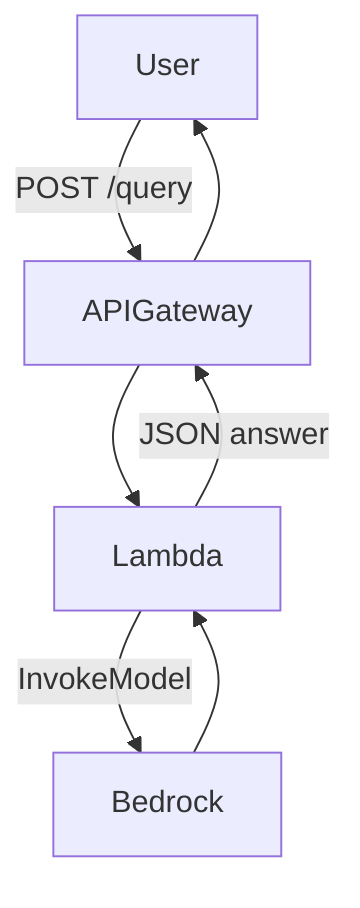

[]
[]

# Time-Series ➜ LLM API

## 1. What the Service Does

A serverless API that accepts raw multivariate time-series health data plus a user question and returns a context-aware answer generated by an Amazon Bedrock LLM.  
The Lambda no longer performs server–side descriptive statistics; instead, the raw vitals JSON is passed directly to the model which computes any required aggregates on-the-fly.  
Timestream has been **temporarily disabled** – all vitals must be supplied by the caller.

## 2. High-Level Architecture

The system is built on AWS CDK, deploying an API Gateway, Lambda, Timestream, and Bedrock integration. Lambda functions validate and summarize incoming data, query Timestream if needed, and invoke Bedrock for LLM inference. All infrastructure is managed as code for reproducibility and scale. See the architecture diagram below and in [docs/architecture.mmd](docs/architecture.mmd):

## 3. Data & Control Flow

1. User sends HTTP POST to `/query` with prompt and (optionally) timeseries data.
2. API Gateway routes request to Lambda.
3. Lambda validates input and builds a compact raw-JSON context containing the vitals.
4. Lambda invokes Bedrock LLM, which performs any statistical reasoning required.
5. Bedrock returns answer; Lambda formats and returns JSON response to user.

## 4. Design Decisions & Rationale

- **Serverless**: Minimizes operational overhead and scales to demand; pay-per-use.
- **CDK Infrastructure-as-Code**: Ensures reproducible, auditable deployments.
- **Amazon Bedrock**: Chosen for secure, managed LLM inference with clinical compliance.
- **Defensive Token Budgeting**: Truncates context to avoid runaway costs and latency.
- **Raw-Data Delegation**: Descriptive statistics are shifted to the LLM, reducing Lambda logic and token usage.
- **Timestream Disabled**: Prototype currently avoids AWS persistence for faster iteration and lower cost; can be re-enabled behind the `USE_TIMESTREAM` flag.
- **Stateless API**: No user data is persisted server-side while Timestream is disabled.
- **IAM Policy**: Lambda permissions are broad for prototype; will be tightened for least-privilege.

## 5. Operational Characteristics

- **Latency Targets**: dominated by Bedrock inference (<9 s p95).
- **Cost Drivers**: Bedrock invocations and Lambda duration (no database reads).
- **IAM Blast Radius**: Current wildcard permissions; to be scoped to resource ARNs.
- **Observability**: Plans for structured logging and metrics (see TECH_DEBT).

## 6. CI/CD & Quality Gates

- **Deploy Workflow**: On push to main, deploys via GitHub Actions and AWS CDK.
- **Test & Coverage Workflow**: Separate CI runs pytest with coverage, uploads to Codecov.
- **Badges**: Build and coverage status shown above, powered by GitHub Actions and Codecov.
- **Quality Gates**: PRs require passing tests and coverage thresholds.

## 7. Artefacts & Further Docs

- [docs/architecture.mmd](docs/architecture.mmd) – System architecture diagram (Mermaid)
- [docs/dependency-graph.mmd](docs/dependency-graph.mmd) – Code dependency graph
- [docs/TECH_DEBT.md](docs/TECH_DEBT.md) – Technical debt registry
