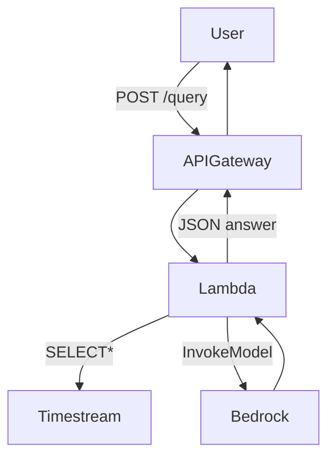

[]
[]

# Time-Series ➜ LLM API

## 1. What the Service Does

A serverless API that transforms raw multivariate time-series health data and a user question into a safe, context-aware LLM answer. It ingests data from clients or fetches from AWS Timestream, summarizes trends, and leverages Amazon Bedrock for clinical-grade natural language responses—all with strict token and cost controls.

## 2. High-Level Architecture

The system is built on AWS CDK, deploying an API Gateway, Lambda, Timestream, and Bedrock integration. Lambda functions validate and summarize incoming data, query Timestream if needed, and invoke Bedrock for LLM inference. All infrastructure is managed as code for reproducibility and scale. See the architecture diagram below and in [docs/architecture.md](docs/architecture.md):

## 3. Data & Control Flow

1. User sends HTTP POST to `/query` with prompt and (optionally) timeseries data.
2. API Gateway routes request to Lambda.
3. Lambda validates input; if data missing, queries Timestream for latest values.
4. Lambda summarizes data, builds context, and invokes Bedrock LLM.
5. Bedrock returns answer; Lambda formats and returns JSON response to user.

## 4. Design Decisions & Rationale

- **Serverless**: Minimizes operational overhead and scales to demand; pay-per-use.
- **CDK Infrastructure-as-Code**: Ensures reproducible, auditable deployments.
- **Amazon Bedrock**: Chosen for secure, managed LLM inference with clinical compliance.
- **Defensive Token Budgeting**: Truncates context to avoid runaway costs and latency.
- **Data Fallback**: If client omits timeseries, Lambda fetches from Timestream for resilience.
- **IAM Policy**: Lambda permissions are broad for prototype; will be tightened for least-privilege.
- **Stateless API**: No user data is persisted outside Timestream.

## 5. Operational Characteristics

- **Latency Targets**: <1s for Timestream queries; <9s for Bedrock inference.
- **Cost Drivers**: Bedrock invocations, Timestream reads, Lambda duration.
- **IAM Blast Radius**: Current wildcard permissions; to be scoped to resource ARNs.
- **Observability**: Plans for structured logging and metrics (see TECH_DEBT).

## 6. CI/CD & Quality Gates

- **Deploy Workflow**: On push to main, deploys via GitHub Actions and AWS CDK.
- **Test & Coverage Workflow**: Separate CI runs pytest with coverage, uploads to Codecov.
- **Badges**: Build and coverage status shown above, powered by GitHub Actions and Codecov.
- **Quality Gates**: PRs require passing tests and coverage thresholds.

## 7. Artefacts & Further Docs

- [docs/architecture.mmd](docs/architecture.md) – System architecture diagram (Mermaid)
- [docs/dependency-graph.mmd](docs/dependency-graph.md) – Code dependency graph
- [docs/TECH_DEBT.md](docs/TECH_DEBT.md) – Technical debt registry
